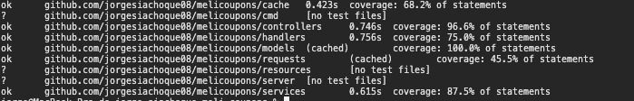
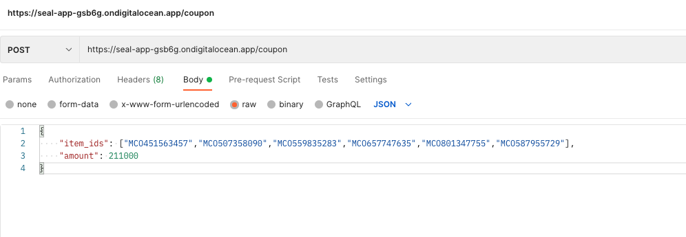
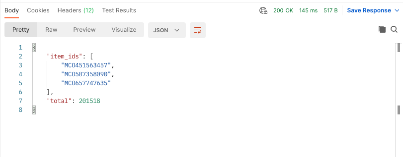
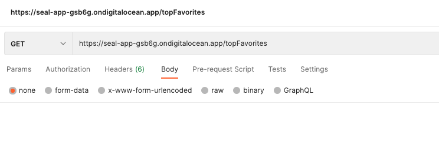
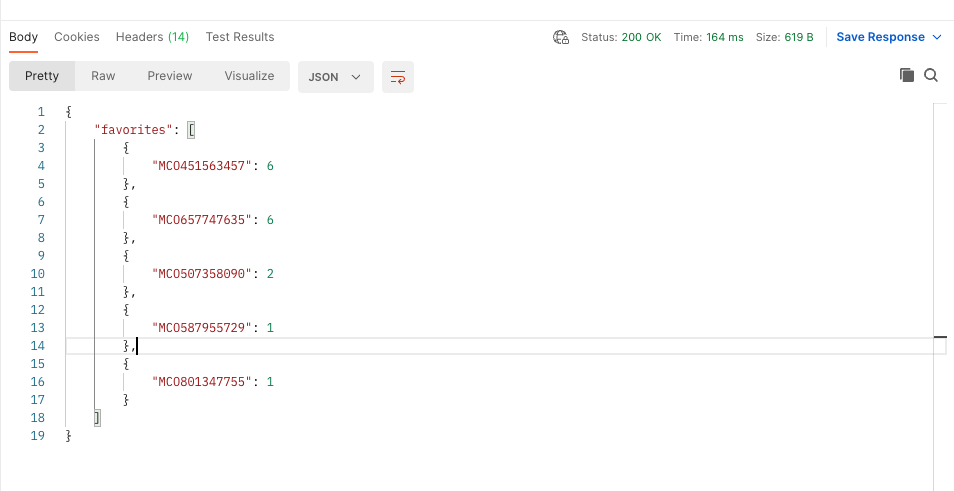

# melicoupons
API que maximiza el total gastado de un cupo sin exceder su totalidad  y obtiene el top 5 de favoritos que mas han sido adquiridos por cupones

## Requerimiento

### Challenge: Cupón de compra

Mercado Libre está implementando un nuevo beneficio para los usuarios que más usan la
plataforma con un cupón de cierto monto gratis que les permitirá comprar tantos ítems
marcados como favoritos sea posible, siempre que no excedan el monto del cupón.
Para esto se está analizando construir una API que dado una lista de item_id y el monto
total pueda devolver la lista de ítems que maximice el total gastado.

#### Nivel 1

Crear una API REST, con el servicio “/coupon/” en donde se pueda enviar la lista de
item_ids y el monto del cupón. El endpoint debe devolver los items que tendría que comprar
el usuario.

#### Nivel 2
Definir e implementar un endpoint el cual devuelva el top 5 de items más “favoriteados” a
partir del endpoint anterior

## Validación de coverage



## Pasos para la ejecucion

### Docker

- Para iniciar clona el projecto

```bash
git clone https://github.com/jorgesiachoque08/melicoupons.git
```

- Ingresa a la carpeta 

```bash
cd melicoupons 
```
- Ejecute docker-compose
```bash
docker-compose up --build
```

### En tu local:
    
Es necesario tener intalasdo Go y Redis( >= v6) en tu maquina
- Para iniciar clona el projecto

```bash
git clone https://github.com/jorgesiachoque08/melicoupons.git
```

- Ingresa a la carpeta 

```bash
cd melicoupons 
```
- Ejecute main.go
```bash
go run cmd/main.go
```

## Api

La APi se encuntra desplegada en digitalocean

### POST /coupon:
[https://seal-app-gsb6g.ondigitalocean.app/coupon](https://seal-app-gsb6g.ondigitalocean.app/coupon)

- Request


- Response



### GET /topFavorites:
[https://seal-app-gsb6g.ondigitalocean.app/topFavorites](https://seal-app-gsb6g.ondigitalocean.app/topFavorites)

- Request


- Response
